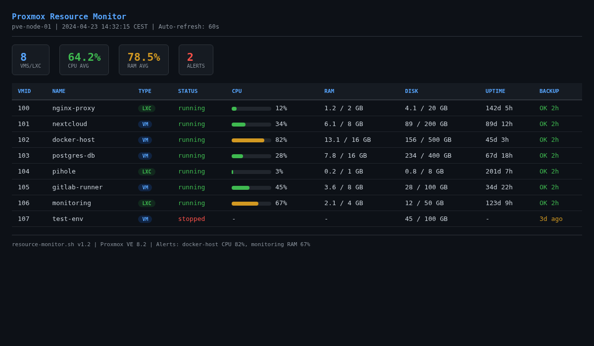

# Proxmox Automation Toolkit

[](https://gnu.org/software/bash/)
[](https://python.org)
[](https://proxmox.com)
[](LICENSE)

> Bash & Python Scripts für Proxmox VE — Backups, VM-Management, Monitoring & Deployment automatisieren.

Bash & Python scripts for Proxmox VE — automate backups, VM management, monitoring & deployment.

---

## Screenshot


*Live-Ressourcenübersicht aller VMs/LXC: CPU, RAM, Disk, Uptime & Backup-Status auf einen Blick.*

---

## Script-Übersicht

| Script | Sprache | Beschreibung |
|--------|---------|-------------|
| `scripts/backup-manager.sh` | Bash | Automatisches Backup aller VMs/CTs mit Retention |
| `scripts/vm-snapshot.sh` | Bash | Snapshot vor Updates erstellen |
| `scripts/resource-monitor.sh` | Bash | CPU/RAM/Disk-Überwachung aller VMs |
| `python/proxmox_api.py` | Python | API-Wrapper-Klasse für Proxmox |
| `python/deploy_ct.py` | Python | LXC Container automatisiert deployen |
| `python/health_report.py` | Python | Wöchentlicher HTML-Health-Report |

---

## Quick Start

```bash
git clone https://github.com/ceeceeceecee/proxmox-automation-toolkit.git
cd proxmox-automation-toolkit

# Konfiguration
cp config/settings.example.yaml config/settings.yaml

# Backup testen (Dry-Run)
bash scripts/backup-manager.sh --dry-run

# Cron-Einträge ansehen
cat cron/crontab.example
```

### Voraussetzungen

- Proxmox VE 7.x+
- Bash 5.0+
- Python 3.10+ (für Python-Scripte)
- `pvesh` CLI (auf dem Proxmox-Host)
- API-Token mit entsprechenden Berechtigungen

---

## Architektur

```
+-------------------+     +------------------+     +------------------+
|   Cron / systemd  | --> |  Bash Scripts    | --> |  Proxmox VE API  |
+-------------------+     +------------------+     +------------------+
                                  |
                                  v
                          +------------------+
                          | Python Scripts    |
                          | (pvesh / API)     |
                          +------------------+
                                  |
                                  v
                          +------------------+
                          | Benachrichtigung  |
                          | (Mail / Telegram) |
                          +------------------+
```

---

## Sicherheitshinweise

**API-Token statt Passwort!**

1. Proxmox Web-UI → Datacenter → Permissions → API Tokens
2. Neuen Token mit minimalen Berechtigungen erstellen
3. Token in `config/settings.yaml` eintragen
4. **Niemals** Root-Passwort in Skripten speichern

Siehe [docs/proxmox-api-setup.md](docs/proxmox-api-setup.md) für Details.

---

## Use Cases

| Zielgruppe | Szenario |
|------------|----------|
| Homelab | Backups & Updates automatisieren |
| KMU | Server-Überwachung ohne Monitoring-Stack |
| Systemadministrator | LXC-Deployment standardisieren |
| MSP | Multi-Node Health-Reports |

---

## Tech Stack

- **Bash** — System-Administration
- **Python** — API-Wrapper & Reports
- **Proxmox VE API** — pvesh & REST API
- **Cron** — Zeitgesteuerte Ausführung

---

## Roadmap

- [ ] Web-Dashboard für Health-Reports
- [ ] Multi-Node Support
- [ ] Ansible-Integration
- [ ] Grafana Dashboard Templates

---

## Contributing

1. Fork → Feature-Branch → Commit → Push → Pull Request

---

## Lizenz

[MIT](LICENSE) — frei nutzbar.

## Author

[ceeceeceecee](https://github.com/ceeceeceecee)

## Weitere Projekte

- [Self-Hosted AI Chatbot](https://github.com/ceeceeceecee/self-hosted-ai-chatbot) — Auf Proxmox deployen
- [n8n Business Automation](https://github.com/ceeceeceecee/n8n-business-automation) — Als VM betreiben
